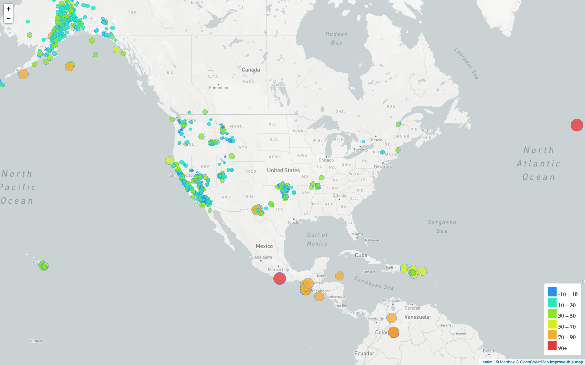

# Leaflet - Visualizing Data with Leaflet

## Background

Welcome to the United States Geological Survey, or USGS for short! The USGS is responsible for providing scientific data about natural hazards, the health of our ecosystems and environment; and the impacts of climate and land-use change. Their scientists develop new methods and tools to supply timely, relevant, and useful information about the Earth and its processes. As a new hire, you will be helping them out with an exciting new project!

The USGS is interested in building a new set of tools that will allow them visualize their earthquake data. They collect a massive amount of data from all over the world each day, but they lack a meaningful way of displaying it. Their hope is that being able to visualize their data will allow them to better educate the public and other government organizations (and hopefully secure more funding..) on issues facing our planet.

### Tools Used
1. **Html**
2. **Javascript**
3. **CSS**
4. **Visual Studio Code**
5. **Leaflet**
6. **Map-BOX**
7. **GITHUB**

### Leaflet-Step-1 
1. [index.html](https://github.com/Kpearson72/leaflet-challenge/blob/main/Leaflet-Step-1/index.html)
2. [logic.js](https://github.com/Kpearson72/leaflet-challenge/blob/main/Leaflet-Step-1/static/js/logic.js)
3. [style.css](https://github.com/Kpearson72/leaflet-challenge/blob/main/Leaflet-Step-1/static/css/style.css)

---

### Level 1: Basic Visualization 
***Completed Visualization - See below***

#### TASKS COMPLETED: 

1. Using an online json datasets create a world map visualization of earthquakes with markers based on magnitude of earthquakes.
2. Add a legend to illustrate magnitude scale 

**Dataset**
   

   The USGS provides earthquake data in a number of different formats, updated every 5 minutes. Visit the [USGS GeoJSON Feed](http://earthquake.usgs.gov/earthquakes/feed/v1.0/geojson.php) page and pick a data set to visualize. 

   

- - -

### Level 2: More Data 
***Completed Visualization - See below***

### Leaflet-Step-1 
1. [index.html](https://github.com/Kpearson72/leaflet-challenge/blob/main/Leaflet-Step-2/index.html)
2. [logic.js](https://github.com/Kpearson72/leaflet-challenge/blob/main/Leaflet-Step-2/static/js/logic.js)
3. [style.css](https://github.com/Kpearson72/leaflet-challenge/blob/main/Leaflet-Step-2/static/css/style.css)

The USGS wants you to plot a second data set on your map to illustrate the relationship between tectonic plates and seismic activity. You will need to pull in a second data set and visualize it along side your original set of data. Data on tectonic plates can be found at <https://github.com/fraxen/tectonicplates>.

#### TASKS COMPLETED: 

1. Plotting a second data set on map.

2. Adding a number of base maps to choose from as well as separate out our two different data sets into overlays that can be turned on and off independently.

3. Adding layer controls to our map.

- - -

